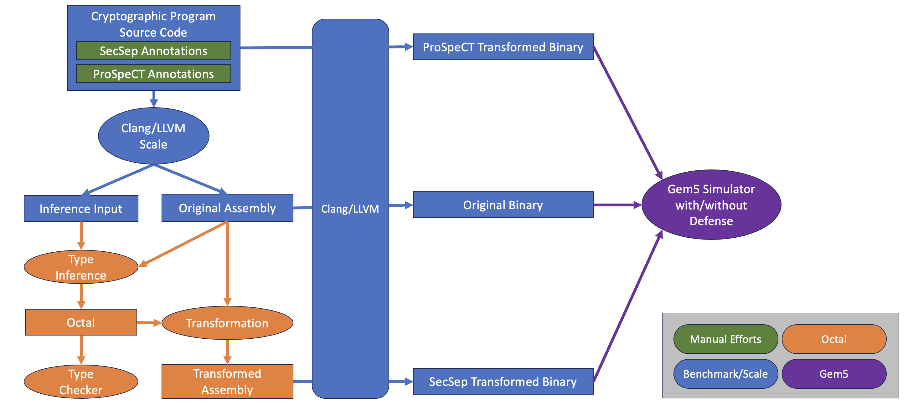

---
puppeteer:
  landscape: true
  format: "A4"
  printBackground: true
  outline: true
---

<!-- @import "[TOC]" {cmd="toc" depthFrom=1 depthTo=6 orderedList=false} -->

<!-- code_chunk_output -->

- [1. Overview](#overview)
  - [1.1. *SecSep* Workflow](#secsep-workflow)
  - [1.2. Artifact Hierarchy Explained](#artifact-hierarchy-explained)
- [2. Environment Setup](#environment-setup)
  - [2.1. Docker](#docker)
  - [2.2. Docker Resource Limitation](#docker-resource-limitation)
  - [2.3. Build and Start Docker Containers](#build-and-start-docker-containers)
  - [2.4. Build Components](#build-components)
- [3. Run Toolchain for Benchmarks](#run-toolchain-for-benchmarks)
  - [3.1. How to Read Evaluation Results](#how-to-read-evaluation-results)
- [4. Components Explained](#components-explained)
  - [4.1. Conventions](#conventions)
    - [4.1.1. OCaml and S-Exp](#ocaml-and-s-exp)
    - [4.1.2. Naming](#naming)
    - [4.1.3. Scripts](#scripts)
  - [4.2. Scale](#scale)
    - [4.2.1. Usage](#scale-usage)
    - [4.2.2. Important Files](#scale-directories)
  - [4.3. Benchmark](#benchmark)
    - [4.3.1. How Benchmarks are Crafted](#how-benchmarks-are-crafted)
    - [4.3.2. Important Files](#benchmark-directories)
  - [4.4. Octal](#octal)
    - [4.4.1. Usage](#octal-usage)
    - [4.4.2. Important Files](#octal-directories)
  - [4.5. Gem5](#gem5)
    - [4.5.1. Defense Summary](#defense-summary)
    - [4.5.2. Important Files](#gem5-directories)

<!-- /code_chunk_output -->


<!-- <div style="page-break-after: always;"></div> -->

# 1. Overview

Here is a brief abstract of our work *SecSep*:

> Cryptographic software, while following constant-time coding guidelines, may still leak secrets under speculative execution. For defenses where the processor tracks secrets using taint tracking and delays secret-leaking speculation, precisely tracking secrets in memory is crucial to avoid overtainting and unnecessary delays. Tracking secrets on the stack is especially challenging because secrets can mix with public data.
>
> We present a prototype implementation of *SecSep*, a transformation framework that rewrites assembly programs at compile time by identifying and partitioning secret and public data on the stack.  After partitioning, secret and public data are divided into different pages. This enables a simple yet precise way for taint tracking to tell the secrecy of data loaded from the memory. *SecSep* introduces a typed assembly language *Octal* and a heuristic inference algorithm to recover lost dataflow semantics at assembly level.
>
> Programs transformed by *SecSep* achieve secure speculation with an average overhead of 1.2%, on a hardware implementing simple taint tracking.

This artifact implements the entire *SecSep* workflow, which infers, transforms, and evaluates cryptographic programs.

Guidelines on how to use this README:

* **To simply understand this artifact and reproduce the results**:
  * Read [Section 1](#1-overview) for a quick overview
  * Follow [Section 2](#2-environment-setup) and [Section 3](#3-run-toolchain-for-benchmarks) to setup environments and reproduce the results.
* **To explore how the components work**:
  * Read [Section 4](#4-components-explained)
  * Explore the code!

## 1.1. *SecSep* Workflow



*SecSep* workflow consists of four components (marked with different colors) and can be described in five steps:

1. <span style="color:green">User writes down SecSep annotations in the source code for each function.
2. <span style="color:blue">Benchmark toolchain compiles source code into assembly and generates inputs for the inference tool.
3. <span style="color:orange">Type inference tool infers dependent type, valid region, and taint type, generating *Octal* as the output. Then, type checker verifies the correctness of *Octal*, and original assembly is transformed using information from *Octal*.
4. <span style="color:blue">Benchmark toolchain compiles original and transformed assemblies to binaries.
5. <span style="color:purple">Binaries are run on Gem5 simulator with or without the ProSpeCT-style defense to evaluate their performance.


## 1.2. Artifact Hierarchy Explained

The four components are explained in the following table.
We use different colors to indicate where they are in the workflow.

`$ROOT` represents the root directory where this `README` file locates.

<div class="table1">
|Component|Location|Purpose|
|:-|:-|:-|
|<span style="color:blue">Scale|`$ROOT/scale`|A tiny AST walker based on Clang to collect source-code information:<br>(1) Help parse *SecSep* annotations on each function.<br>(2) Get statistics of each function, e.g. the number of arguments.|
|<span style="color:blue">Benchmark|`$ROOT/benchmark`| A directory to hold all benchmarks and do the compilation stuff.<br>(1) Contain the source code of all benchmarks. <br>(2) Use Scale to parse *SecSep* annotations and generate inputs for inference. <br>(3) Compile source code into assembly; compile (transformed) assembly into binary.|
|<span style="color:orange">Octal|`$ROOT/octal`| Inference algorithms to infer Octal, the typed assembly language, from the raw assembly code.<br>(1) Infer the dependent type, valid region, and taint type. <br>(2) Check the inference results using a small-TCB checker. <br>(3) Transform original assembly based on inferred Octal using *SecSep*'s transformations.<br>(4) Run evaluations using (transformed) binaries and Gem5.|
|<span style="color:purple">Gem5 Simulator|`$ROOT/gem5`|Implement the ProSpeCT-style hardware defense on O3 CPU for evaluation.|
</div>


To get more information about each component, please read [Section 4](#4-components-explained).

# 2. Environment Setup

## 2.1. Docker

We use Docker to provide a stable environment for all components.

You need to install Docker if your OS does not have one.
Installation instructions can be found at [here](https://docs.docker.com/engine/install/).
We recommend following the steps of
1. Click on your platform's link
2. Follow section "Uninstall old versions"
3. Follow section "Install using the apt repository"

Our test platform uses `Docker version 27.5.1`, though most versions of Docker should work.
If you encounter any problem, please consider upgrade or downgrade to this version, or contact us directly for supports.

## 2.2. Docker Resource Limitation

The Docker container we provide has some expectations on available resources:

* CPU cores: As many as possible.
Both the container build and *SecSep* workflow can benefit from the parallelism.
* Memory: At least 16 GB. 32+ GB is recommended.
* Free disk space: At least 128 GB.

If you are using Docker Desktop:

* Docker Desktop usually has strict limits on CPU, memory, and disk usage.
* Open `Docker Desktop → Settings → Resources` and try to meet the expectations.

If you are running Docker directly without Docker Desktop

* Simply verify your host platform has at least 16 GB of free RAM and 128 GB of available disk space.

## 2.3. Build and Start Docker Containers

Inside `$ROOT` directory, run
```bash
$ docker compose up -d --build
# For older Docker, the command is "docker-compose" instead
```
to build the all-in-one container `secsep` for all four components.
In case the build fails, it's likely due to exhausted resources.
Please try to run the command again to restart the build from the failure point.

Run `docker ps` to make sure it is built and started successfully.

To attach to the container, simply run
```bash
$ docker exec -it secsep /bin/zsh
```

The entire `$ROOT` directory on the host is mapped to `/root/secsep` (or `~/secsep`) in the container.
Unless otherwise specified, all following operations are performed inside the container, where `$ROOT` is assumed to be `~/secsep`.


## 2.4. Build Components

Among all components, <span style="color:blue">Scale</span>, <span style="color:orange">Octal</span>, and <span style="color:purple">Gem5</span> needs to be built.
However, you only need to build <span style="color:purple">Gem5</span> manually.
The other two are built automatically when they are invoked.

To build Gem5:
```bash
# switch to Gem5 directory
$ cd ~/secsep/gem5

# build Gem5 using Scons
# <nproc> is at your discretion
$ scons build/X86_MESI_Two_Level/gem5.opt -j<nproc>
# You will see the following prompt:
# > You're missing the pre-commit/commit-msg hooks. These hook help to ensure your
# > ...
# > Press enter to continue, or ctrl-c to abort:
# Simply press <Enter> to continue
```

To build Scale and Octal manually (not necessary):
```bash
# It's OK to see this warning
# >[WARNING] Running as root is not recommended

# build scale
$ cd ~/secsep/benchmark
$ make scale
# build octal
$ cd ~/secsep/octal
$ dune build && dune install
```

# 3. Run Toolchain for Benchmarks

Currently there are six supported benchmarks: `salsa20`, `sha512`, `chacha20`, `x25519`, `poly1305`, `ed25519_sign`. Their source code are located under the benchmark directory.

We provide commands to run *SecSep* toolchain on one or all benchmarks.
These commands correspond to the five steps introduced in the [workflow section](#11-workflow).
You must switch to the specified directory to run the commands.
The results of each command is briefly explained.
More information are provided in later sections.

Here are some configurable arguments and their explanation:

* `<bench>` specifies the benchmark you choose to work on.
  Commands without `<bench>` work on all available benchmarks.
* `<delta>` specifies the delta (in bytes) used by *SecSep* transformation.
  Must be specified in hexadecimal format.
  In paper's evaluation, we use `0x800000`, i.e. 8MB.

<div class="table2">
|Step|Work Directory|Commands|Results|
|:-:|:-|:-|:-|
|1|`~/secsep/benchmark`| *SecSep* annotations have been written by us. You can search `"@secsep"` in the benchmark directory to get a preview of them by running `grep -rnI "@secsep"`.<br>Both SecSep and ProSpeCT needs global symbol annotations (`SECRET_SYM`/`PUBLIC_SYM`).<br>In addition, ProSpeCT needs to annotate every function variable using `SECRET_VAR`/`PUBLIC_VAR`.|N/A|
|2|`~/secsep/benchmark`|Use `make paper -j` to compile and construct inference inputs for all benchmarks, or use `make <bench>` to work on a specific benchmark.|You can find the assembly code and compile-time information like call graph, struct layouts, and stack spill slots under `analysis/<bench>`.|
|3|`~/secsep/octal`    |Run `./scripts/run.py full --delta <delta> --name <bench>` to infer, check, and transform one benchmark.<br> Run `--name <bench1>,<bench2>,...` to work on multiple benchmarks.<br>To work on all benchmarks in parallel, just remove the `--name` argument.|Infer results and logs are under `out/<bench>`. Transformed assemblies are installed to `~/secsep/benchmark/analysis/<bench>/<bench>.<transform>.s`.|
|4|`~/secsep/benchmark`|`./scripts/get_binaries.py`|Compiled binaries are at `analysis/<bench>/build`.|
|5|`~/secsep/octal`    |Run `./scripts/eval.py --delta <delta> -p 16 -v` to let Gem5 execute all original/transformed binaries and evaluate their performance. The parallelism is controlled by `-p` (FYI, there are 42 evaluation tasks. Be careful that too much parallelism may drain your memory). Use `-v` or `-vv` to get verbose output. <br>You will see the prompt "Will run gem5, confirm?". Press `y` and `<Return>` to confirm starting fresh Gem5 runs to get evaluation results.|An evaluation directory named by current time will be generated under `eval`.|
|6|`~/secsep/octal`    |Run `./scripts/figure.py <eval dir>` to draw figures according to the evaluation, where `<eval dir>` is the directory generated in step 5.|Figures are under `<eval dir>/figures`.|
</div>

## 3.1. How to Read Evaluation Results

> In this and following sections, we will use regular expression to represent filenames.
> For example, `?` indicates that the preceding element is optional,
> `(xx|yy)` denotes a choice between alternatives,
> and `[abc]` matches any single character from the set `a`, `b`, or `c`.

Each time `~/secsep/octal/eval.py` is executed, a directory will be generated under `~/secsep/eval`.
This directory contains important results generated by the evaluation:

* `bench/`: Collection of all original and transformed assemblies (`*.s`), binaries, and disassembled binary (`*.asm`).
* `secsep.(csv|tex)`: Source-code statistics for all functions in each benchmark, e.g. total number of lines of code / function arguments / local variables, etc.
This is used to generate Table 1 in the paper.
* `gem5/`: Detail statistics of Gem5 when executing each binary.
* `declassification/`: To illustrate the effectiveness of SecSep's transformation,
  when Gem5 with defense enabled runs a binary, it reports PC of any instruction that declassifies, i.e. nonspeculatively storing tainted data into public memory.
  Because current benchmarks do not contain declassification behaviors, any such PC indicates the existence of leakage or overtainting.
  Readers can locate declassifying instructions in the binary using the PC and the corresponding `*.asm` file.
  Here are the major takeaways:
  * Cryptographic functions in the original binary and insecurely transformed binaries contain declassifying instructions, e.g. storing secrets into the public stack.
    * `<bench>.decl.txt`: Original binary
    * `<bench>.prospect_pubstk.decl.txt`: ProSpeCT public-stack scheme
  * *SecSep* transformations without $C_{\text{callee}}$ also incur declassification.
  As analyzed in Section 7.2, Figure 11 in the paper,
  the major cause is overtainting due to inaccurate secret/public data separation and is fixed by introducing $C_{\text{callee}}$.
    * `<bench>.tf[23].decl.txt`
  * Cryptographic functions in the securely transformed binaries do not declassify at all.
    * `<bench>.prospect_secstk.decl.txt`: ProSpeCT secret-stack scheme
    * `<bench>.tf1?.decl.txt`: SecSep's full transformation and full transformation without consecutive push pop optimization.
  * Declassifying instructions within C library functions are expected,
    since transforming the C library and determining the secrecy of its global symbols are out of scope in this prototype.
* `eval.csv`: Gem5's statistics when running binaries with or without the defense.
  This is used to generate Figure 12 in the paper.
  * Software overhead is calculated by comparing transformed binary's `gem5_cycles_def-off` with the original binary's `gem5_cycles_def-off`.
  * Comprehensive overhead is calculated by comparing transformed binary's `gem5_cycles_def-on` with the original binary's `gem5_cycles_def-off`.
* `stats/`: Statics when running Octal component's phases, e.g. time elapsed, number of SMT calls.
This is used to generate Figure 17 in the appendix.
* `figures/`: After running `~/secsep/octal/scripts/figure.py`, the overhead figure (Figure 12) and *SecSep* efficiency figure (Figure 17) used in the paper will appear here.

# 4. Components Explained

This section explains the purpose, structure, and intermediate products of each component.
It is not mandatory to read this section in order to use the toolchain.
However, it will help readers who want to delve into the code, inspect crucial intermediate products, or reuse the code to start their own development.

## 4.1. Conventions

### 4.1.1. OCaml and S-Exp

Many components are implemented using OCaml.
To transfer OCaml data structures between components,
we use S-Exp serialization provided by `sexp` library,
which converts OCaml data into a JSON-like text file.
In this artifact, it is a convention that serialized products are named with the suffix of `.sexp`.

### 4.1.2. Naming

In `.sexp` products and the source code:

* We use `Single*` prefix on symbolic expressions related to the dependent type.
For example,
e.g. `SingleVar 42` is a symbolic variable of id `42`,
and `SingleBExp SingleAdd (SingleVar 6) (SingleConst 4)` is a symbolic expression adding a symbolic variable `6` and constant number `4`.
* We use `Taint*` prefix on symbolic expressions related to the taint type.
For example, `TaintConst true` represents tainted, and `TaintVar 7` is a variable of taint.

### 4.1.3. Scripts

All scripts mentioned below support `-h`/`--help` to show the detail usages.

## 4.2. Scale

Scale is written in OCaml 4.14.2, an OCaml version compatible with the critical helper library `clangml`.

To bind `clangml` to LLVM 16.0.6 instead of the default LLVM 14,
we build it from source code (commit `52df9b7`), which is located at `~/clangml/`.
The build commands can be found at `$ROOT/Dockerfile`.
The source code can be accessed at the [official GitHub repo](https://github.com/ocamllibs/clangml).

### 4.2.1. Usage {#scale-usage}

There are four major subcommands:

* `build`: Given a Clang compile command, parse the source code and obtain SecSep annotations for each function.
  * Product: `$ROOT/benchmark/analysis/<bench>/<bench>.sexp`
  * Type definition: In `src/func_input.ml`:
```ocaml
type t =
  { func_name : string
  ; reg_type : Reg_type.t
  ; mem_type : Mem_type.t
  ; constr_info : ConstrInfo.t
  }
[@@deriving sexp, fields]
```
* `struct`: Extract layout of all struct.
  * Product: `$ROOT/benchmark/analysis/<bench>/<bench>.struct.sexp`
  * Type definition: In `src/func_input.ml`, find `module RecordInfo`
* `stat`: For each function, count the lines of code, number of local variables, function arguments, ProSpeCT/SecSep annotations.
  * Product: `$ROOT/benchmark/analysis/<bench>/<bench>.stat`, `analysis/<bench>/<bench>.stat_noopt`, where `noopt` version includes all functions before any inlining.
* `merge`: Merge the product of `build` and auxiliary information (e.g. stack spill information, global symbols) and generate the final input for the Octal inference algorithms.
  * Product: `$ROOT/benchmark/analysis/<bench>/<bench>.final.sexp`
  * Type definition: In `src/func_input.ml`, find `type final_t =`.

These commands are invoked by `scripts/compile_benchmark.py` under Benchmark component.

### 4.2.2. Important Files {#scale-directories}

* `docs/annotation-grammar.txt`: Syntax of *SecSep* annotation
* `src/main.ml`: Main entry of Scale defining all subcommands
* `src/func_input.ml`: Define the types of inputs for the Octal inference algorithms.
* `src/syntax.ml`: Define the structs for annotation and function.


## 4.3. Benchmark

### 4.3.1. How Benchmarks are Crafted

Many of our benchmarks are adapted from [BoringSSL](https://boringssl.googlesource.com/boringssl), an open-source cryptographic library.
The base version is commit `d26384906`, located under `$ROOT/benchmark/third_party/boringssl`.
It can be viewed online through [this link](https://github.com/google/boringssl/tree/d2638490679527185fe9817e24eca316acc93d96).

We override selected BoringSSL source files by placing their modified versions under `$ROOT/benchmark/src/boringssl`.
These files follow the same directory hierarchy as the BoringSSL source tree.
Readers can inspect the changes by comparing each modified file with its paired counterpart in the base BoringSSL source tree.

When searching for a file to include during benchmark compilation, the build system uses the modified version if available; otherwise, it falls back to the base version.
The priority logic is defined in `$ROOT/benchmark/Makefile`.

To simplify the linking, we include the definition of all symbols in the benchmark entry file.

### 4.3.2. Important Files {#benchmark-directories}

* `src/`
  * `include/secsep.h`: Annotation macros used by *SecSep* and ProSpeCT.
  * `entry/`: Entry point of all benchmarks
  * `boringssl/`: Replaced files for BoringSSL with *SecSep* annotations
* `third_party/boringssl/`: BoringSSL source tree
* `scripts/`
  * `compile_benchmark.py`: Compile source code into assembly and generate inputs for Octal.
  It also performs ProSpeCT-style transformation.
  * `get_binaries.py`: Compile (ProSpeCT-/SecSep-transformed) assemblies into binaries.
* `analysis/`: Original assemblies, inputs for Octal, transformed assemblies, built binaries
  * `<bench>.s`: Original assembly
  * `<bench>.tf[123]?.s`: SecSep-transformed assemblies; available after Octal runs
  `tf` is the full transformation, while `tf1`/`tf2`/`tf3` are full transformation without consecutive push pop optimization / without $C_{\text{callee}}$ / without both.
  * `<bench>.prospect_(pub|sec)stk.s`: ProSpeCT-transformed assemblies, using public-/secret-stack scheme

## 4.4. Octal

Octal inference, checking and transformation are written in OCaml 5.3.0.

Octal inference algorithms accept the original assembly and inference inputs generated by Benchmark component,
and output the inferred Octal.
It contains five phases:

* Phase 0: Preprocess assembly and parse inputs
  * Products: `out/<bench>/<bench>.(prog|input)`
* Phase 1: Dependent type infer
  * Products: `out/<bench>/<bench>.single_infer(_interface)?`
* Phase 2: Valid region infer
  * Product: `out/<bench>/<bench>.range_infer`
* Phase 3: Taint type infer
  * Products: `out/<bench>/<bench>.(taint_infer|interface)`
* Phase 4: `isNonChangeExp` infer (see Section 5.2 in the paper)
  * Products: `out/<bench>/<bench>.(taint_infer|interface)` (updated)

Octal checker accepts the inferred Octal and checks its correctness.
It contains two phases:

* Phase 0: Convert Octal to checker's internal format
  * Products: `out/<bench>/<bench>.checker_(interface|func)`
* Phase 1: Check Octal's correctness (Phase 1 executes Phase 0 before starting its own job because products of Phase 0 cannot be easily serialized)

Octal transformation takes the inferred Octal and the original assembly, and outputs the transformed assembly.

  * Products: `out/<bench>/<bench>.tf[123]?.s`


### 4.4.1. Usage {#octal-usage}

We provide a python script `scripts/run.py` to run all phases of the Octal.
```bash
./scripts/run.py infer --name <bench> --input-dir ~/secsep/benchmark/analysis --phase 0 4
./scripts/run.py check --name <bench> --phase 1 1
./scripts/run.py transform --name <bench> --delta 0x800000 --all-tf --install-dir ~/secsep/benchmark/analysis
```
The above commands can be executed with one command:
```bash
./scripts/run.py full [--name <benches>] --analysis-dir ~/secsep/benchmark/analysis --delta 0x800000
```

After the (transformed) assemblies are compiled into binaries by Benchmark component,
you can use the helper script `scripts/eval.py` to measure the software overhead and comprehensive overhead by running the binaries on a Gem5 OoO processor with or without defense.

```bash
./scripts/eval.py --delta 0x800000 -p 16 -v
```

Figures can be drawn using

```bash
./scripts/figure.py eval/<eval dir>
```


### 4.4.2. Important Files {#octal-directories}

* `lib/`: Inference algorithms and transformation
* `checker/`: Type checker
* `bin/`: Entry point of all phases
  * Inference phase 0: `preprocess_input.ml`
  * Inference phase 1: `infer_single.ml`
  * Inference phase 2: `infer_range.ml`
  * Inference phase 3: `infer_taint.ml`
  * Inference phase 4: `infer_change.ml`
  * Checker phase 0: `convert.ml`
  * Checker phase 1: `check.ml`
  * Transformation: `prog_transform.ml`
* `interface/`: Interface of common functions
* `scripts/`
  * `run.py`: Helper script to run phases
  * `eval.py`: Run evaluation using Gem5
  * `figure.py`: Generate figures using evaluation results

## 4.5. Gem5

We develop the ProSpeCT-style defense based on the open-source processor simulator [Gem5](https://www.gem5.org/),
using version `v22.1.0.0` (commit `5fa484e`) as the base.
Changes made can be found at `~/secsep/gem5/secsep-changes.patch`.

### 4.5.1. Defense Summary

The defense can be divided into two parts:

1. How to determine/track secrets?
   * `src/sim/process.hh`: Statically determine the taint of loaded data.
   * `src/cpu/regfile.hh`: Track register taint in the register file.
   * `src/arch/*`: Case-study each X86 instruction and construct a proper taint propagation logic.
   * `src/cpu/o3/dyn_inst.cc:propagateTaint()`: Taint propagation.
2. How to delay secret-leaking speculative executions?
   * `src/cpu/o3/*`: Delay secret-leaking speculative operations such as loads/stores with tainted address, squashes based on tainted condition, insecure LSQ forwarding, etc.

### 4.5.2. Important Files {#gem5-directories}

* `scripts/`
  * `run.py`: A helper script called by `~/secsep/octal/scripts/eval.py` to run a binary with or without enabling the defense.
Inside the script, different execution modes are:
    * `CONFIG_NONE`: No defense
    * `CONFIG_OURDEFENSE`: ProSpeCT-style defense
  * `get_decl.py`: A helper script called by `~/secsep/octal/scripts/eval.py` to report PC of any instruction that declassifies, i.e. storing tainted data into public memory.
* `results/raw_data/`: Simulation logs 

